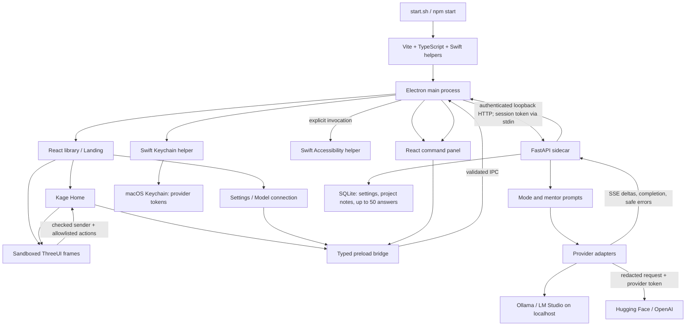

# ICARUS — implemented architecture

This document follows the current code. Future product ideas are recorded in `PRO.md` and `DESIGN.md`. Repository indexing, automatic code execution/replacement, packaging, and auto-updates are not implemented.

## Entry points and UI

- `start.sh` supervises the desktop launcher; `stop.sh` stops its verified process group. The web variants serve the UI without desktop capabilities.
- `frontend/electron/main.ts` creates windows, registers ⌘⇧Q, supervises Python, validates IPC, manages model connections, and relays response events.
- `frontend/src/main.tsx` mounts `Landing`. Three library books open Settings, Home, or Model connection. `Home.tsx` routes the eight coding modes and project-memory dialog.
- `frontend/src/popup-main.tsx` mounts `Popup`, which handles selection permissions, editable inputs, mentor moods, streamed text, bounded follow-ups, cancellation, copying, and retries.
- Both React roots have a rendering-error fallback with a reload action. Expected async failures are handled by the relevant screen. Desktop navigation awaits loading promises so failed loads reach callers.
- Authored ThreeUI scenes run in isolated frames. They receive no native bridge. Parent renderers validate the sending window and fixed action allowlists.

## Python API

`backend/main.py` binds to loopback when launched by Electron. Electron generates a per-session token, sends it over stdin, and authenticates every API request.

| Endpoint | Implemented behavior |
| --- | --- |
| `GET /health` | Local service readiness |
| `GET /v1/settings`, `PUT /v1/settings` | Provider/model settings without credentials |
| `POST /v1/provider/test` | Short connectivity/model probe |
| `GET /v1/memory`, `PUT /v1/memory` | Bounded user-authored project, goal, and notes |
| `GET /v1/history`, `DELETE /v1/history` | Read or clear the local answer cache |
| `POST /v1/chat/stream` | Validate a mode request and stream an answer |

`backend/modes.py` supplies educational prompts for the eight modes and automatic selection analysis. Requests may include a project description, explicitly selected saved notes, a mentor mood, and up to three preceding user/assistant exchanges.

`backend/providers.py` implements Ollama and OpenAI-compatible adapters for LM Studio, Hugging Face, and OpenAI. Destinations are fixed, environment proxies and redirects are disabled, and requests have bounded timeouts. Interrupted streams, invalid or empty answers, response limits, filtering, and unsupported actions return safe failure messages. Model requests are not retried automatically.

## Response lifecycle

The backend emits `delta`, `done`, or `error` SSE events. It caps total output at 256 KiB and splits large deltas. The desktop validates frames and forwards only recognized error messages. The popup preserves partial answers and shows specific recovery guidance. Clearing history increments a revision so in-flight requests cannot repopulate the cleared cache.

SQLite failures return a safe HTTP 503, validation failures a safe 422, and unexpected API failures a safe 500. Existing contracts remain compatible: HTTP errors use `detail`, connection probes return `status`/`message`, and stream errors use the SSE error event.

Diagnostics include the operation, exception type, and stack locations without exception messages, locals, tokens, or submitted code. Backend stderr is available through the desktop launcher. A backend exit triggers at most one automatic restart; failed restarts return guidance to restart ICARUS.

## Storage and trust boundaries

`backend/storage.py` stores settings and project notes in a `state` table and keeps up to 50 rows in `history`. Access uses a lock and transactions; file permissions are restricted. History input/output is redacted. History writes remain best effort: a failed write is diagnosed without discarding the delivered answer.

Provider tokens are managed by `frontend/electron/keychain.ts` and `frontend/native/keychain.swift`. They are supplied to the authenticated backend only when needed and are not stored in SQLite or renderer storage. The selection helper reads external highlighted text following explicit user invocation; manual paste is also supported.

Electron enables context isolation and sandboxing, disables Node integration, restricts navigation/window opening, validates IPC inputs, and bounds custom-protocol asset paths. AI output is text with no execution or editor-write authority.

## Source ownership and verification

`frontend/vendor/threeui` retains source bundles, hashes, original assets, and provenance. `prepare-scene.mjs`, `prepare-kage.mjs`, and `prepare-bestsellers.mjs` verify sources and regenerate public derivatives. Application changes belong in generators or React wrappers; registered originals remain byte-exact.

The native build retains the existing Keychain helper until its source hash changes, preserving local trust. Generated renderer/desktop/native files are local outputs excluded from Git.

Source tests cover integrity, IPC validation, selection authorization, Keychain fixtures, service supervision, response parsing, API failures, storage, and launcher lifecycle. Optional browser tests exercise recovery screens and response feedback. Native packaging and live-provider integration are separate checks.
